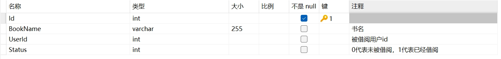
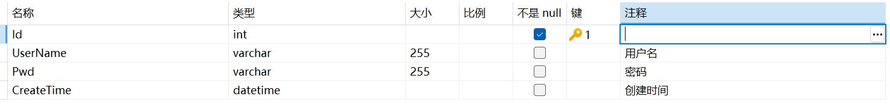
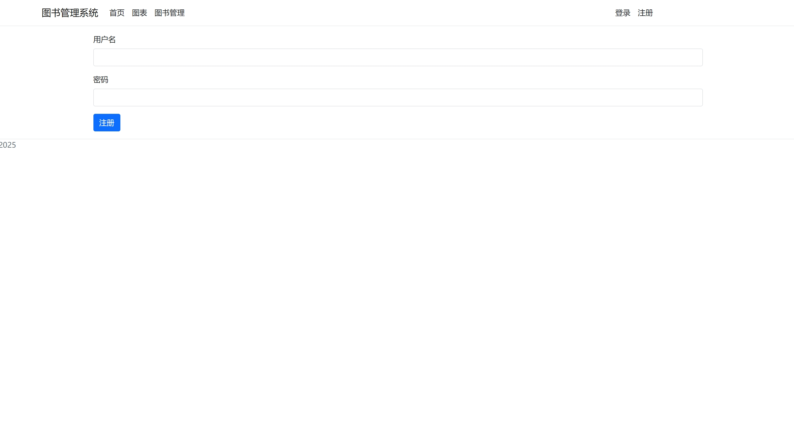
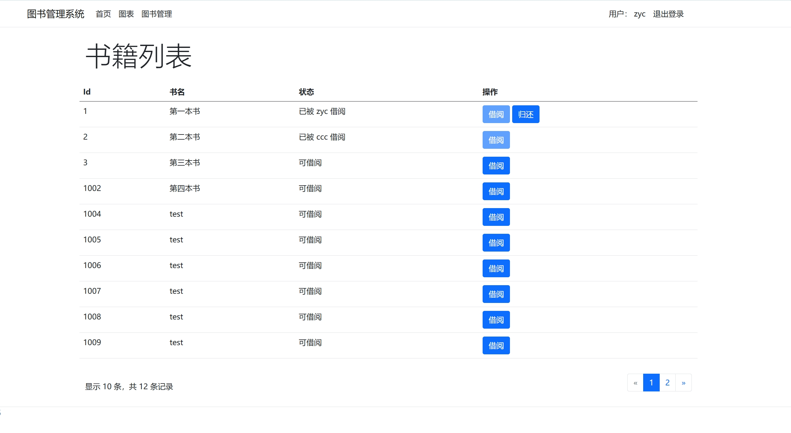
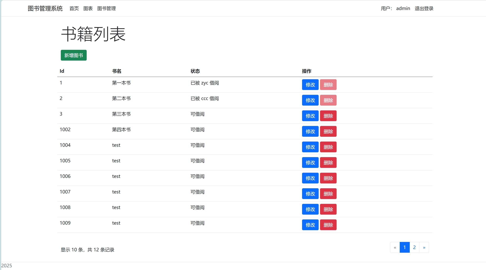
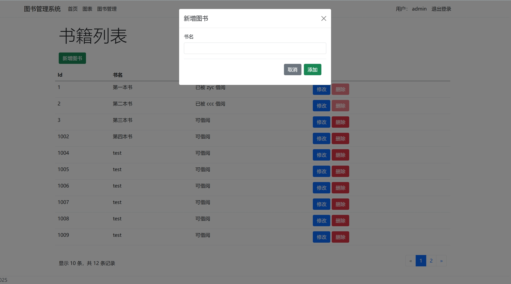
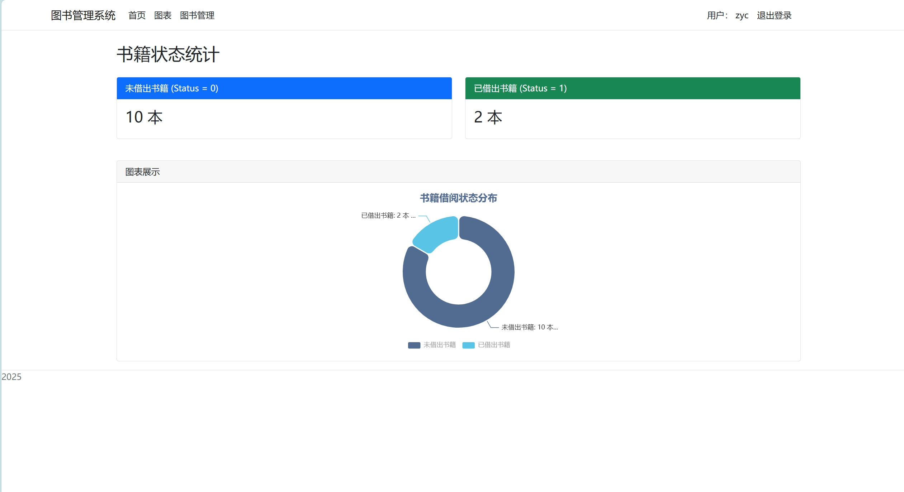

#### 图书管理系统

> 该项目仅仅是为了学习 ASP.NET MVC ，所有数据库表，功能，样式上都为最简单的部分。

##### 需求分析(简单版)

用户模块：用户可以登录，注册，退出登录，图书的借阅，图书的归还，图书的查询（分页查询）

管理员模块：拥有普通用户的所有功能以及，新增图书，修改图书，删除图书

##### 数据库设计

###### Book 表

###### User 表

##### 技术栈

ASP.NET MVC + EF + SqlServer

##### 相关演示图

###### 登录

###### 注册

###### 首页

###### 书籍管理页面（管理员访问）

###### 新增图书

###### 图表页（ECharts）

